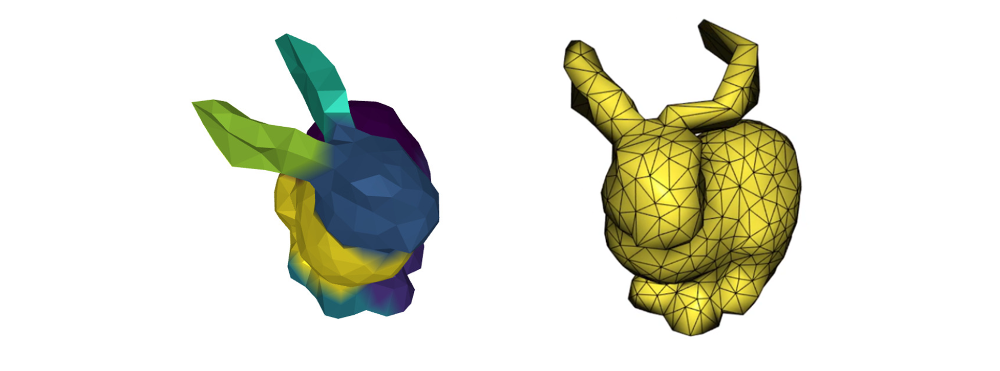

# Meshless Deformations Based on Shape Matching
Final project of the Physics-Based Animation course at the University of Toronto during fall semester 2021.



## Report
The report can be found [here](docs/report.pdf).

## Building
Assuming all the dependencies are installed one can build the binary in the following way
```
mkdir build
cd build
cmake ..
make
```

## Options
When running the program the user can pass one of the following arguments `single`, `coarse` or `tetrahedron` to choose the clustering method.
